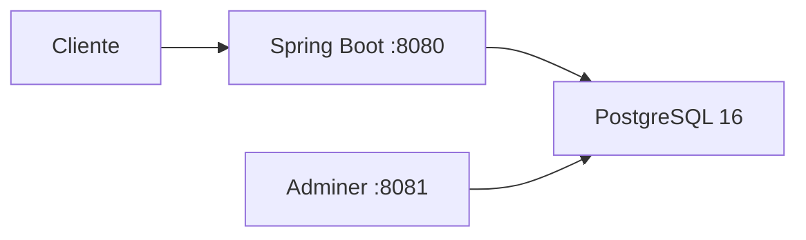
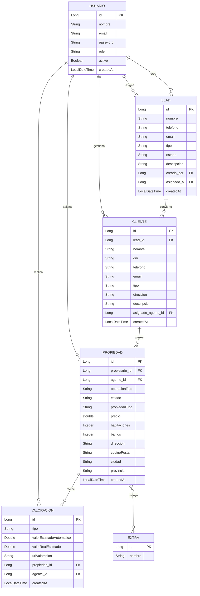

# DOMUS CRM - Jennifer Herrera

## Resumen del dominio

DOMUS CRM es una API REST para una inmobiliaria que centraliza usuarios internos, leads, clientes verificados, propiedades, extras y valoraciones.

## Descripción 
El objetivo del proyecto:

- captar un lead
- convertirlo en cliente
- asignar agentes
- registrar propiedades
- valorar inmuebles
- consultar métricas y búsquedas

## Tecnologías 

### Backend

- Java 17+
- Spring Boot
- Spring Web
- Spring Data JPA
- Spring Security
- Hibernate
- Lombok

### Base de datos

- PostgreSQL 16
- Docker

### Frontend

- Html
- Css
- JavaScript


## Estructura del proyecto

```text
src/main/java/com/crm/crm_domus/
├── model/           ← Entidades JPA (@Entity)
│   └── enums/       ← Enumeraciones del dominio
├── repository/      ← Interfaces JpaRepository
├── service/         ← Lógica de negocio (@Service)
├── controller/      ← Endpoints REST (@RestController)
├── dto/             ← Request/response DTOs
│   ├── request/
│   └── response/
├── config/          ← Configuración (Swagger/OpenAPI)
├── security/        ← Seguridad y filtros
└── exception/       ← Manejo global de errores
```

## Entidades y relaciones

| Entidad     |  Descripción | Campos destacados                                                   | Relaciones |
|-------------|---|---------------------------------------------------------------------|---|
| `Usuario`   | Usuario interno del CRM con rol | `nombre`, `email`, `password`, `role`, `activo`                     | Un usuario puede estar asignado a leads, propiedades, clientes y valoraciones |
| `Lead`      |  Contacto inicial pendiente de conversion | `nombre`, `telefono`, `email`, `tipo`, `estado`                     | Muchos leads pueden pertenecer a un usuario                                 |
| `Cliente`   | Cliente verificado | `nombre`, `dni`, `telefono`, `email`, `tipo`                        | Un cliente nace de un `Lead` y puede estar asignado a un usuario            |
| `Propiedad`  | Inmueble gestionado por la inmobiliaria | `precio`, `ciudad`, `direccion`, `estado`, `propiedadTipo`          | Muchas propiedades pertenecen a un `Cliente` y a un `Usuario`                  |
| `Extra`   | Caracteristica o extra de una propiedad | `nombre`                                                            | Relacion `@ManyToMany` con `Propiedad`                                       |
| `Valoración` | Valoración de una propiedad | `tipo`, `valorEstimadoAutomatico`, `valorRealEstimado`, `createdAt` | Muchas valoraciones pertenecen a una `Propiedad` y opcionalmente a un `Usuario` |


## Endpoints principales

### Usuario

| Metodo | Endpoint | Accion |
|---|---|---|
| `GET` | `/api/usuarios` | Listar usuarios |
| `GET` | `/api/usuarios/{id}` | Obtener usuario |
| `POST` | `/api/usuarios` | Crear usuario |
| `PUT` | `/api/usuarios/{id}` | Actualizar usuario |
| `DELETE` | `/api/usuarios/{id}` | Eliminar usuario |

### Leads

| Metodo | Endpoint | Accion |
|---|---|---|
| `GET` | `/api/leads` | Listar leads |
| `GET` | `/api/leads/{id}` | Obtener lead |
| `GET` | `/api/leads/search` | Buscar leads |
| `POST` | `/api/leads` | Crear lead |
| `PUT` | `/api/leads/{id}` | Actualizar lead |
| `DELETE` | `/api/leads/{id}` | Eliminar lead |

### Clientes

| Metodo | Endpoint | Accion |
|---|---|---|
| `GET` | `/api/clientes` | Listar clientes |
| `GET` | `/api/clientes/{id}` | Obtener cliente |
| `GET` | `/api/clientes/search` | Buscar clientes |
| `POST` | `/api/clientes` | Crear cliente |
| `PUT` | `/api/clientes/{id}` | Actualizar cliente |
| `DELETE` | `/api/clientes/{id}` | Eliminar cliente |

### Propiedades

| Metodo | Endpoint | Accion |
|---|---|---|
| `GET` | `/api/propiedades` | Listar propiedades |
| `GET` | `/api/propiedades/{id}` | Obtener propiedad |
| `GET` | `/api/propiedades/{id}/valoraciones` | Listar valoraciones de la propiedad |
| `GET` | `/api/propiedades/{id}/extras` | Listar extras de la propiedad |
| `GET` | `/api/propiedades/search` | Busqueda avanzada paginada |
| `GET` | `/api/propiedades/search-global` | Busqueda global |
| `POST` | `/api/propiedades` | Crear propiedad |
| `PUT` | `/api/propiedades/{id}` | Actualizar propiedad |
| `DELETE` | `/api/propiedades/{id}` | Eliminar propiedad |

### Extras y valoraciones

| Metodo | Endpoint                                    | Accion |
|---|---------------------------------------------|---|
| `GET` | `/api/extras`                               | Listar extras |
| `GET` | `/api/extras/{id}`                          | Obtener extra |
| `POST` | `/api/extras`                               | Crear extra |
| `PUT` | `/api/extras/{id}`                          | Actualizar extra |
| `DELETE` | `/api/extras/{id}`                          | Eliminar extra |
| `GET` | `/api/valoraciones`                         | Listar valoraciones |
| `GET` | `/api/valoraciones/{id}`                    | Obtener valoración |
| `GET` | `/api/valoraciones/propiedad/{propiedadId}` | Obtener por propiedad |
| `POST` | `/api/valoraciones`                         | Crear valoración |
| `PUT` | `/api/valoraciones/{id}`                    | Actualizar valoración |
| `DELETE` | `/api/valoraciones/{id}`                    | Eliminar valoración |

## Arquitectura

Flujo:





## Ejecución Backend

### Local con PostgreSQL

```bash
cd backend/crm_domus
./mvnw spring-boot:run
```

Variables soportadas:

- `SPRING_DATASOURCE_URL`
- `SPRING_DATASOURCE_USERNAME`
- `SPRING_DATASOURCE_PASSWORD`

### Con Docker Compose

```bash
cd backend/crm_domus
docker compose up --build
```

Puertos:

- API: `http://localhost:8080`
- Swagger UI: `http://localhost:8080/swagger-ui.html`
- Adminer: `http://localhost:8081`

## Funcionalidad avanzada elegida

Se implementó la opción de queries avanzadas:

- `@Query` JPQL en `LeadRepository`, `ClienteRepository` y `PropiedadRepository`
- búsqueda de propiedades con filtros
- paginación con `Pageable`
- ordenación dinámica

## Tests y CI

La validación automatizada se ejecuta con Maven sobre [backend/crm_domus/pom.xml](/E:/domus_asesores/backend/crm_domus/pom.xml). El flujo de CI quedó definido en [ci.yml](/E:/domus_asesores/.github/workflows/ci.yml) y se dispara en cada `push` y `pull_request`.

Además de los tests de integración existentes, ahora hay tests unitarios para services principales:

- `UsuarioService`
- `LeadService`
- `ClienteService`
- `PropiedadService`

## Ejecución Frontend

```bash
cd front
python -m http.server 5500
```
Puerto:

http://localhost:5500

## Capturas de pantalla

Swagger:


Adminer:


PostgreSQL:


Búsqueda desde Postman:


Gestión de usuarios:


## Despliegue en Railway

El repositorio ya queda preparado para CI y para desplegar el backend como servicio Dockerizado desde [Dockerfile](/E:/domus_asesores/Dockerfile). Para publicarlo en Railway:

1. Crea un proyecto nuevo desde el repositorio de GitHub.
2. Añade un servicio PostgreSQL gestionado por Railway.
3. Configura las variables del `.env.example`, ajustando `SPRING_DATASOURCE_URL` al host interno que asigne Railway.
4. Railway inyecta `PORT` automáticamente y la aplicación ya lo soporta en [application.properties](/E:/domus_asesores/backend/crm_domus/src/main/resources/application.properties).


## Estado del proyecto

Este proyecto solo es una muestra ofrecida para el trabajo final del curso de Hibernate/Spring. El proyecto personal real para el crm inmobiliario está en proceso de creación, que incorporará módulos como agenda, documentos, automatizaciones, facturación y seguimiento comercial avanzado.


## Autora

Jennifer Herrera
