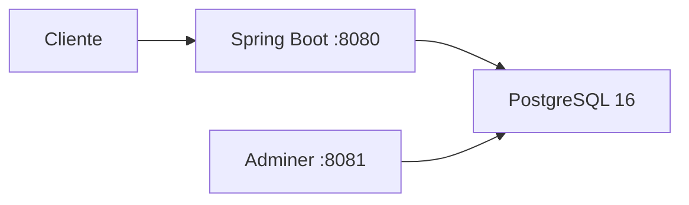

# Infraestructura Docker - Bloque A

## Arquitectura general

La solución queda compuesta por tres servicios en Docker Compose:

- `app`: API Spring Boot
- `db`: PostgreSQL 16
- `adminer`: interfaz web para inspeccionar la base de datos

Flujo:




## Dockerfile

Se usa un build multi-stage:

1. Imagen `maven:3.9.9-eclipse-temurin-21` para compilar el proyecto.
2. Imagen `eclipse-temurin:21-jre` para ejecutar solo el jar final.

Esto reduce el tamaño del contenedor final y evita meter Maven en runtime.
```dockerfile
# Etapa 1: compilar el proyecto con Maven
FROM maven:3.9.9-eclipse-temurin-21 AS build
WORKDIR /app
COPY pom.xml .
COPY src ./src
RUN mvn clean package -DskipTests

# Etapa 2: ejecutar solo el JAR compilado
FROM eclipse-temurin:21-jre
WORKDIR /app
COPY --from=build /app/target/*.jar app.jar
EXPOSE 8080
ENTRYPOINT ["java", "-jar", "app.jar"]
```
## docker-compose.yml
```yml
version: "3.9"

services:
  app:
    build: .
    container_name: crm_backend
    depends_on:
      db:
        condition: service_healthy
    environment:
      SPRING_DATASOURCE_URL: ${SPRING_DATASOURCE_URL}
      SPRING_DATASOURCE_USERNAME: ${SPRING_DATASOURCE_USERNAME}
      SPRING_DATASOURCE_PASSWORD: ${SPRING_DATASOURCE_PASSWORD}
      SPRING_DATASOURCE_DRIVER_CLASS_NAME: ${SPRING_DATASOURCE_DRIVER_CLASS_NAME}
      SPRING_JPA_DATABASE_PLATFORM: ${SPRING_JPA_DATABASE_PLATFORM}
      SPRING_JPA_HIBERNATE_DDL_AUTO: ${SPRING_JPA_HIBERNATE_DDL_AUTO}
      SPRING_H2_CONSOLE_ENABLED: ${SPRING_H2_CONSOLE_ENABLED}
    ports:
      - "8080:8080"

  db:
    image: postgres:16-alpine
    container_name: crm_postgres
    environment:
      POSTGRES_DB: ${POSTGRES_DB}
      POSTGRES_USER: ${POSTGRES_USER}
      POSTGRES_PASSWORD: ${POSTGRES_PASSWORD}
    ports:
      - "5432:5432"
    volumes:
      - postgres_data:/var/lib/postgresql/data
    healthcheck:
      test: ["CMD-SHELL", "pg_isready -U ${POSTGRES_USER} -d ${POSTGRES_DB}"]
      interval: 5s
      timeout: 5s
      retries: 5

  adminer:
    image: adminer:latest
    container_name: crm_adminer
    depends_on:
      db:
        condition: service_healthy
    ports:
      - "8081:8080"

volumes:
  postgres_data:
```
### Servicio `app`

- construye desde el `Dockerfile`
- expone `8080:8080`
- espera a que PostgreSQL este healthy
- usa la URL `${SPRING_DATASOURCE_URL}` 

### Servicio `db`

- imagen `postgres:16-alpine`
- crea la BD `${POSTGRES_DB}`
- expone `5432:5432`
- monta un volumen `postgres_data`
- incorpora `healthcheck` con `pg_isready`

### Servicio `adminer`

- imagen `adminer:latest`
- expone `8081:8080`
- depende de PostgreSQL

## Variables de entorno usadas

- `SPRING_DATASOURCE_URL`
- `SPRING_DATASOURCE_USERNAME`
- `SPRING_DATASOURCE_PASSWORD`
- `POSTGRES_DB`
- `POSTGRES_USER`
- `POSTGRES_PASSWORD`

Estas variables se han configurado en `.env` para mayor seguridad.

## Verificación esperada

Al ejecutar:

```bash
cd backend/crm_domus
docker compose up --build
```

debe quedar disponible:

- API en `http://localhost:8080`

- Swagger UI en `http://localhost:8080/swagger-ui.html`
  


- Adminer en `http://localhost:8081`

  

- Postgres
  
## Prompt usado para infraestructura

```text
Dame un ejemplo de docker-compose para mi proyecto. Quiero que la API quede en localhost:8080, Adminer en localhost:8081, que la app espere a la base de datos con healthcheck y que la URL JDBC use el nombre real del servicio de compose.
```